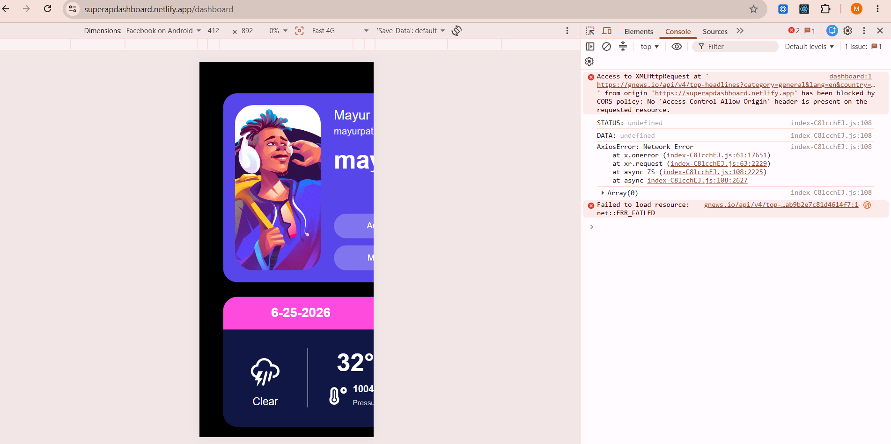

# Super App

A React-based entertainment dashboard that provides personalized movie recommendations, weather updates, latest news, notes management, and a countdown timer in a single application.

## Features

- User Registration
- Category Selection
- Personalized Dashboard
- Weather Information
- Latest News Updates
- Notes with Local Storage
- Countdown Timer
- Movie Recommendations based on selected categories

## Tech Stack

- React.js
- Redux Toolkit
- React Router DOM
- Axios
- React Icons
- CSS3
- Vite

## APIs Used

- OpenWeather API
- TMDB API

## Installation

```bash
git clone https://github.com/12345-dd/superApp
cd super-app

npm install
npm run dev
```

## Environment Variables

Create a `.env` file in the root directory:

```env
VITE_WEATHER_API_KEY=YOUR_WEATHER_API_KEY
VITE_MOVIES_API_KEY=YOUR_TMDB_API_KEY
```

## NOTE 

- This application is optimized for desktop view as per the provided Figma design. 

## Known Issue

The News API works in development but may fail in production due to CORS restrictions.




